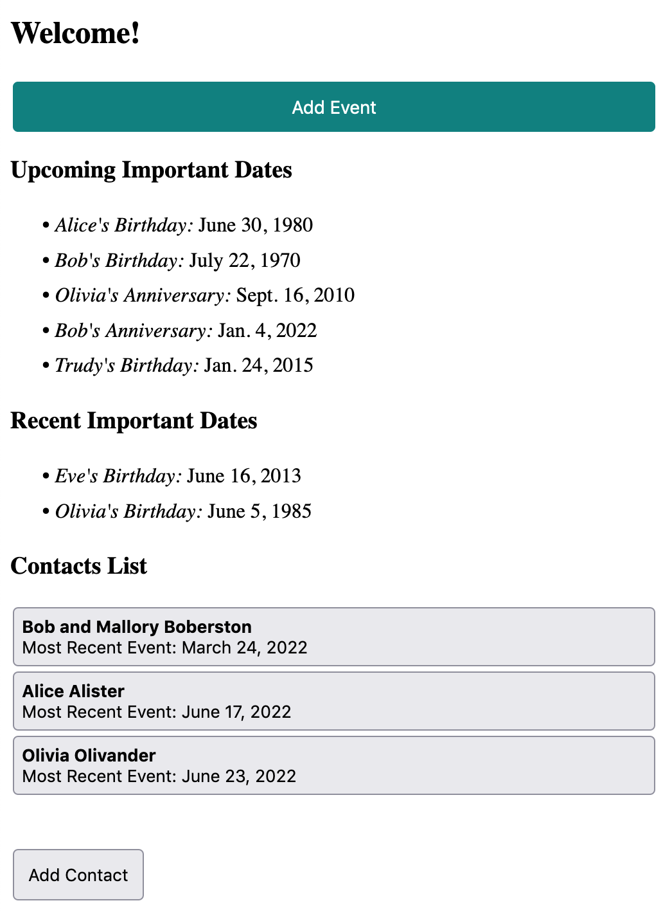
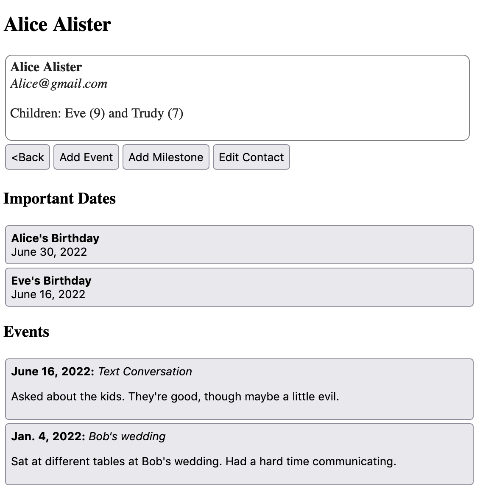

# About

This app theoretically stores information about birthdays, addresses, and events for people in my life. It's inspired by [Monica](https://github.com/monicahq/monica) but even when done will have **substantially fewer** features.



## Functionality
The app is essentially a list of **Contact** objects where each contact has **Events** and **Milestones**. The intended use is that as you interact with contacts, you add events recording those interactions. You can use milestones to record important dates like birthdays.

The `index` page shows upcoming milestones from today, as well as a couple recent past milestones. It also shows the contacts, sorted so that those with recorded recent events are furthest to the bottom. On the `contact_details` page you can see all the recorded information about a given contact.



### Notifications
There's a provided script to grab notifications which you can run with `python manage.py get_notifications_for_today`. This will collect important dates and contacts where `notify_after` is set. Note that this script will not run automatically unless you configure it to do so. This involves: 

  1. If you have [gotify](https://gotify.net/) running, you need to provide a `gotify_url` in the `config.py`.
  
  2. You need to set `python manage.py get_notifications_for_today` to run periodically (e.g. once a day with cron). If you're using a virtual environment, use the path to the Python in that environment rather than `python`.

## Install
The only dependency is `django`, so you can install that with

```
conda create -p env python=3.10 django
```
and then `conda activate django`. To run the app you'll need to make a database, which you can do with `python manage.py migrate`. You will also need a file at the path `contacts_app/config.py` which contains a dictionary with at least one key `secret_key` whose value is a random string, which is necessary to run the app.

After that the server runs with `python manage.py runserver`. See the [django documentation](https://docs.djangoproject.com/en/4.0/) for more details.

## License
Even though this is AGPL licensed code, this project is mostly an excuse for me to learn django so I'm not really sure why you would want to copy it rather than build it from scratch using the tools django provides. I would not recommend it for production use, but you're welcome to copy it so long as you maintain the license.
