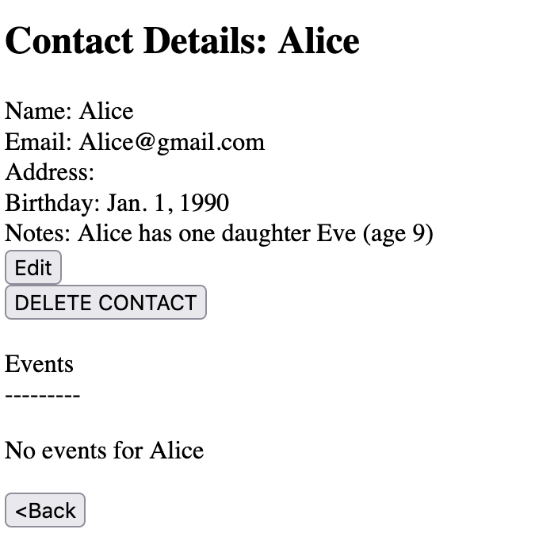

# About

This app theoretically stores information about birthdays, addresses, and events for people in my life. It's inspired by [Monica](https://github.com/monicahq/monica) but even when done will have **substantially fewer** features.




## Install
The only dependency is `django`, so you can install that with

```
conda create -p env python=3.10 django
```
and then `conda activate django`. To run the app you'll need to make a database, which you can do with `python manage.py migrate`. After that the server runs with `python manage.py runserver`. See the [django documentation](https://docs.djangoproject.com/en/4.0/) for more details.

## License
Even though this is AGPL licensed code, this project is mostly an excuse for me to learn django so I'm not really sure why you would want to copy it rather than build it from scratch using the tools django provides. I would not recommend it for production use, but you're welcome to copy it so long as you maintain the license.
